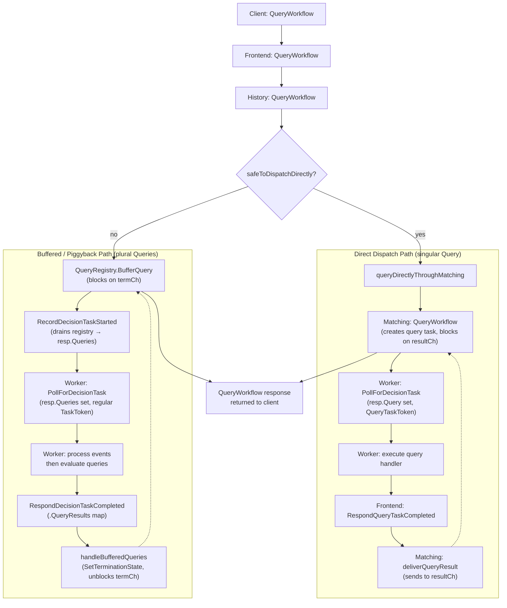

# Cadence Query Dispatch Flow

Client can send `QueryWorkflow` requests to workflows to get current state via two distinct paths.

## Overview




## Consistency

> Query has two consistency levels, eventual and strong. Consider if you were to signal a workflow and then immediately query.
>
> ```sh
> cadence-cli --domain samples-domain workflow signal -w my_workflow_id -r my_run_id -n signal_name -if ./input.json
>
> cadence-cli --domain samples-domain workflow query -w my_workflow_id -r my_run_id -qt current_state
> ```
>
> In this example if signal were to change workflow state, query may or may not see that state update reflected in the query result. This is what it means for query to be eventually consistent.
>
> Query has another consistency level called strong consistency. A strongly consistent query is guaranteed to be based on workflow state which includes all events that came before the query was issued. An event is considered to have come before a query if the call creating the external event returned success before the query was issued. External events which are created while the query is outstanding may or may not be reflected in the workflow state the query result is based on.
> — [Cadence Documentation: Consistent Query](https://cadenceworkflow.io/docs/go-client/queries#consistent-query)

## Decision Criteria

`safeToDispatchDirectly` is `true` (→ direct path) when **any** of these hold:


| Condition                                         | Rationale                                                        |
| ------------------------------------------------- | ---------------------------------------------------------------- |
| `!isActive`                                       | Passive cluster — history is immutable, no new events can arrive |
| `!IsWorkflowExecutionRunning()`                   | Closed workflow — no more events, state is final                 |
| `QueryConsistencyLevelEventual`                   | No consistency guarantee needed                                  |
| `!HasPendingDecision() && !HasInFlightDecision()` | No unprocessed events — worker state is already up-to-date       |


The **buffered path** is used only when **all** conditions fail simultaneously:
active cluster + running workflow + strong consistency + outstanding decision.

## Direct Dispatch Path (singular `Query`)

1. **History** calls `queryDirectlyThroughMatching()` — tries sticky task list first, falls back to non-sticky.
2. **Matching.QueryWorkflow** creates a query task with a unique `taskID`, registers a `queryResultCh`, and calls `DispatchQueryTask` to sync-match with a poller.
3. A waiting poller picks it up via **PollForDecisionTask**. The response has:
  - `resp.Query` (singular `*WorkflowQuery`) set
  - A `QueryTaskToken` (not a regular `TaskToken`)
4. The **worker** detects `Query != nil`, executes the registered query handler, and calls **RespondQueryTaskCompleted**.
5. **Frontend** deserializes the `QueryTaskToken` and forwards to **Matching.RespondQueryTaskCompleted**, which calls `deliverQueryResult` — sending the result to `queryResultCh`.
6. The blocked `QueryWorkflow` goroutine in Matching receives the result and returns it up the stack.

```
Client → Frontend.QueryWorkflow
       → History.QueryWorkflow
       → History.queryDirectlyThroughMatching
       → Matching.QueryWorkflow  (blocks on resultCh)
              ↕ sync match
         PollForDecisionTask     (worker gets resp.Query)
         Worker executes query
         RespondQueryTaskCompleted → deliverQueryResult (unblocks resultCh)
       ← result flows back to client from matching
```

## Buffered / Piggyback Path (plural `Queries`)

1. **History** calls `QueryRegistry.BufferQuery()`, which stores the query in the `buffered` map and returns a `termCh`. The `QueryWorkflow` goroutine blocks on this channel.
2. When the next (or current) decision task is started, `**createRecordDecisionTaskStartedResponse`** drains all buffered queries from the registry into `resp.Queries` (a `map[string]*WorkflowQuery`).
3. The response flows through **Matching → Frontend → worker**. The worker receives both history events and the queries map.
4. The **worker** replays events first (ensuring state is up-to-date), then evaluates each query. Results are returned in **RespondDecisionTaskCompleted** via the `QueryResults` field (`map[string]*WorkflowQueryResult`).
5. **History's `handleBufferedQueries`** iterates over the results, calling `QueryRegistry.SetTerminationState` for each — moving queries from `buffered` to `completed`/`failed` and closing their `termCh`.
6. The blocked `QueryWorkflow` goroutine unblocks, reads the termination state, and returns the result.

```
Client → Frontend.QueryWorkflow
       → History.QueryWorkflow
       → QueryRegistry.BufferQuery  (blocks on termCh)
              ... waits ...
         RecordDecisionTaskStarted  (drains queries into resp.Queries)
         PollForDecisionTask        (worker gets decision + queries)
         Worker processes events, evaluates queries
         RespondDecisionTaskCompleted(.QueryResults)
         handleBufferedQueries → SetTerminationState (unblocks termCh)
       ← result flows back to client from history
```

## Key Differences


| Aspect              | Direct (Query)                                    | Buffered (Queries)                          |
| ------------------- | ------------------------------------------------- | ------------------------------------------- |
| Field on response   | `resp.Query` (singular)                           | `resp.Queries` (plural map)                 |
| Task token type     | `QueryTaskToken`                                  | Regular `TaskToken`                         |
| Worker responds via | `RespondQueryTaskCompleted`                       | `RespondDecisionTaskCompleted.QueryResults` |
| Blocks in           | Matching (`queryResultCh`)                        | History (`termCh` from QueryRegistry)       |
| When used           | No consistency concern or no outstanding decision | Strong consistency + outstanding decision   |


